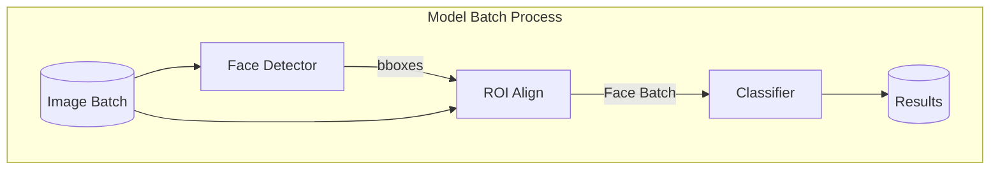
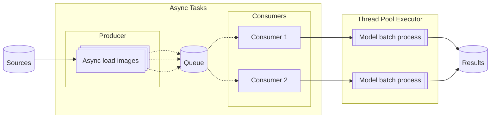

# Eyewear Counter

Быстрая модель для подсчёта количества людей в **очках**, **солнцезащитных очках** и **без очков** на большом наборе изображений. Поддерживает пакетную обработку, асинхронную загрузку и параллельные вычисления для максимальной производительности.


## Архитектура

### Обработка изображений
- **Детекция лиц**: На вход подаётся батч изображений. Детектор возвращает bounding boxes с координатами лиц. Используются предобученные модели: по умолчанию — **YOLOv11** из [akanametov/yolo-face](https://github.com/akanametov/yolo-face/), также доступен **RetinaFace** из [elliottzheng/batch-face](https://github.com/elliottzheng/batch-face).

- **Извлечение областей**: С помощью ROI Align извлекаются области с лицами и приводятся к единому размеру.

- **Классификация**: Батч лиц передаётся в свёрточный классификатор для определения наличия и типа очков. По умолчанию используется **ResNet18**, также доступен **MobileNetV3-Large** — обе модели обучены на собственном датасете, собранном из лиц на изображениях **Open Images**.




### Пайплайн обработки
- **Producer**: Асинхронная загрузка изображений из различных источников (диск, URL).

- **Consumers**: Собирают батчи изображений из общей асинхронной очереди и передают их в модель.

- **Параллельная обработка**: Каждый батч обрабатывается в отдельном потоке ThreadPoolExecutor. Это предусмотрено для CPU-режима, где даёт истинное распараллеливание. При работе с GPU дает небольшое ускорение за счёт конвейеризации (перекрытие загрузки данных и вычислений), несмотря на последовательное исполнение ядер GPU.




## Установка

Через PyPI:

```bash
pip install eyewear-counter
```
Или напрямую из репозитория:

```bash
pip install git+https://github.com/qksolov/eyewear-counter.git
```


## Зависимости
```
torch
torchvision
opencv-python
ultralytics
numpy
pandas
xlsxwriter
aiohttp
nest_asyncio
requests
tqdm
gradio
```

Для оптимальной производительности рекомендуется запуск на GPU с поддержкой CUDA.

## Веб-интерфейс
Запуск веб-приложение для интерактивного тестирования:
```bash
eyewear-counter-app
```


## Пример использования
 ```python
 from eyewear_counter import EyewearCounter

 imgs = ['img1.jpg', 'img2.jpg']
 
 model = EyewearCounter()
 results, num_erorrs = model.run(imgs)
 ```

## Производительность

## Качество моделей