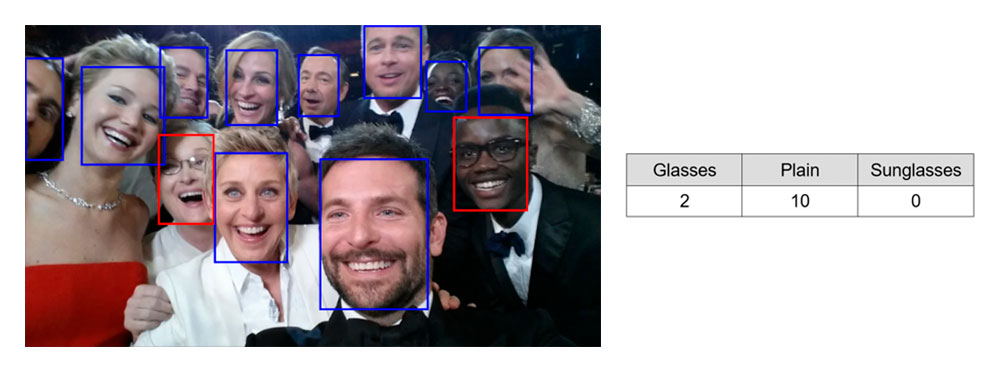

# Eyewear Counter

Быстрая модель для подсчёта количества людей в **очках**, **солнцезащитных очках** и **без очков** на большом наборе изображений. Поддерживает пакетную обработку, асинхронную загрузку и параллельные вычисления для максимальной производительности.



## Установка

Через PyPI:

```bash
pip install eyewear-counter
```
Или напрямую из репозитория:

```bash
pip install git+https://github.com/qksolov/eyewear-counter.git
```


## Зависимости
```
torch
torchvision
opencv-python
ultralytics
numpy
pandas
xlsxwriter
aiohttp
nest_asyncio
requests
tqdm
gradio
```

Для оптимальной производительности рекомендуется запуск на GPU с поддержкой CUDA.

## Веб-интерфейс
Запуск веб-приложение через терминал:
```bash
eyewear-counter-app
```
Онлайн-демо доступно на [Hugging Face Spaces](https://qksolov-eyewear-counter.hf.space/).

## Пример использования
 ```python
 from eyewear_counter import EyewearCounter

 imgs = ['img1.jpg', 'img2.jpg']
 
 model = EyewearCounter()
 results, num_erorrs = model.run(imgs)
 ```

 Более подробный пример использования см. в файле [`example_of_use.py`](https://github.com/qksolov/eyewear-counter/blob/main/notebooks/example_of_use.ipynb).


## Архитектура

### Обработка изображений
- **Детекция лиц**: На вход подаётся батч изображений. Детектор возвращает bounding boxes с координатами лиц. Используются предобученные модели: по умолчанию — **YOLOv11**  [akanametov/yolo-face](https://github.com/akanametov/yolo-face/), также доступен **RetinaFace**  [elliottzheng/batch-face](https://github.com/elliottzheng/batch-face).

- **Извлечение областей**: С помощью ROI Align извлекаются области с лицами и приводятся к единому размеру.

- **Классификация**: Батч лиц передаётся в свёрточный классификатор для определения наличия и типа очков. По умолчанию используется **ResNet18**, также доступен **MobileNetV3-Large** — обе модели обучены на собственном датасете, собранном из лиц на изображениях **Open Images**.


### Пайплайн обработки
- **Producer**: Асинхронная загрузка изображений из различных источников (диск, URL).

- **Consumers**: Собирают батчи изображений из общей асинхронной очереди и передают их в модель.

- **Параллельная обработка**: Каждый батч обрабатывается в отдельном потоке ThreadPoolExecutor. Это предусмотрено для CPU-режима, где даёт истинное распараллеливание. При работе с GPU дает небольшое ускорение за счёт конвейеризации (перекрытие загрузки данных и вычислений), несмотря на последовательное исполнение ядер GPU.


## Производительность
**Конфигурация и параметры тестирования:**

- CPU: тестирование на Intel Core i5-4570 с image_size=640, batch_size=8, max_workers=3 на выборке из 100 изображений.

- GPU: тестирование в Google Colab с NVIDIA Tesla T4, image_size=640, batch_size=32, max_workers=2 на выборке из 1000 изображений.

Проверка проводилась как на локальных файлах, так и на изображениях по URL (по 3 эксперимента, результаты усреднены). Следует учитывать, что время работы может варьироваться из-за скорости отклика при загрузке изображений по сети.


| Детектор           | Классификатор       | Среднее время на изображение CPU (сек) | Среднее время на изображение GPU (сек) |
|--------------------|---------------------|----------------------------------|----------------------------------|
| YoloDetector       | ResNet18            | 0.1449                           | 0.0187                           |
| YoloDetector       | MobileNet_v3_large  | 0.1373                           | 0.0191                           |
| RetinaFaceDetector | ResNet18            | 0.0976                           | 0.0206                           |
| RetinaFaceDetector | MobileNet_v3_large  | 0.0939                           | 0.0207                           |

